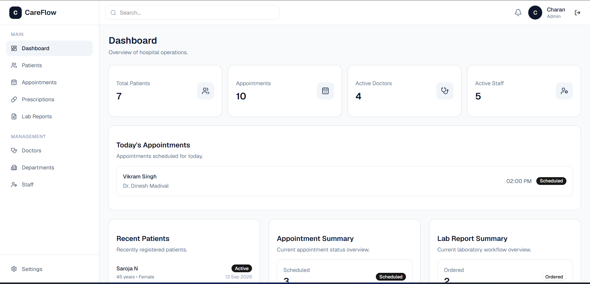
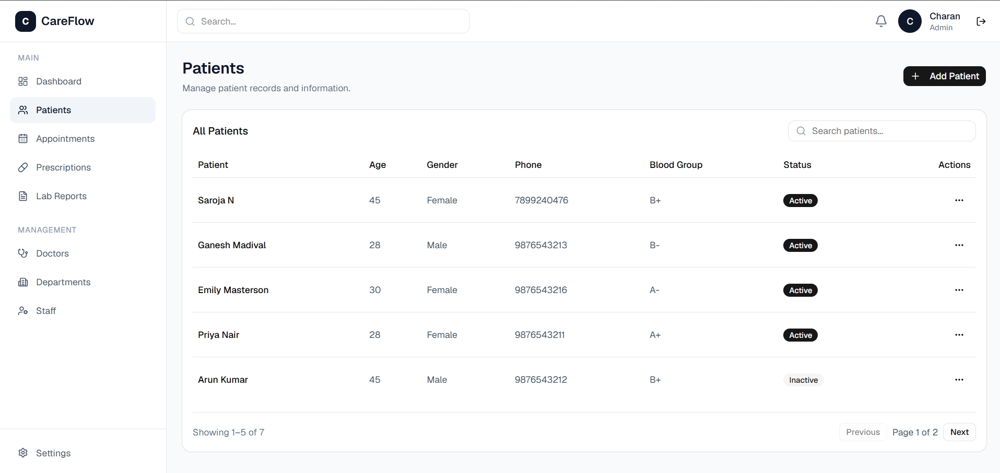
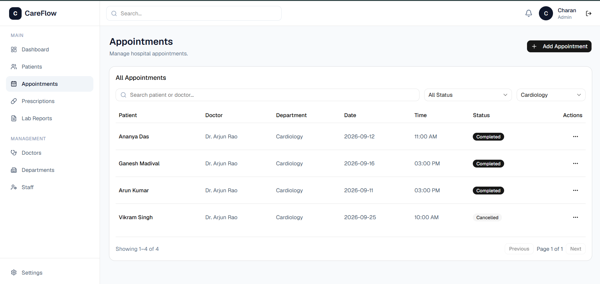
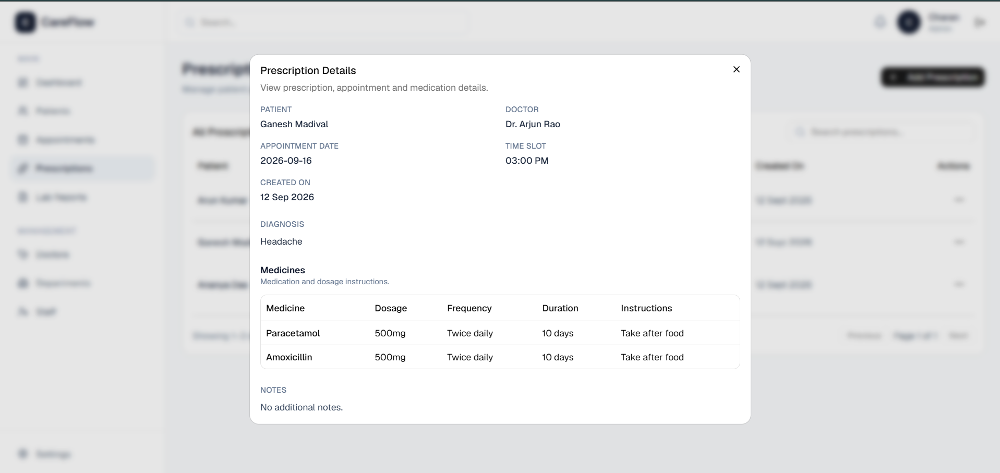
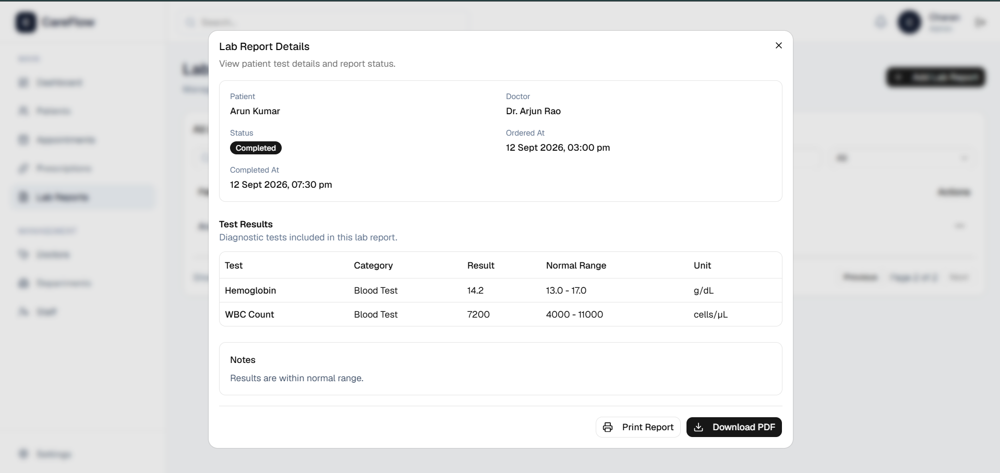
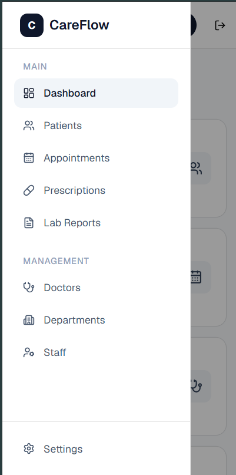

# CareFlow — Hospital Operations Management System

CareFlow is a role-based hospital operations management system built with React and TypeScript. It provides a centralized interface for managing patients, appointments, doctors, departments, staff, prescriptions, and laboratory reports.

The project focuses on real-world frontend engineering practices such as role-based access control, workflow management, data integrity, reusable components, responsive design, form validation, state management, testing, and API integration.

## Live Demo

**Live Application:** https://care-flow-zeta.vercel.app/

**API:** https://careflow-9ob4.onrender.com/

> The API is hosted on Render. On the free hosting tier, the first request may take a little longer if the service has been inactive.

## Features

### Dashboard

- Role-aware dashboard statistics
- Today's appointments
- Recent patient activity
- Appointment status overview
- Different data visibility for Admin, Doctor, and Staff users

### Patient Management

- Add, view, edit, search, and delete patients
- Pagination
- Form validation
- Prevent deletion when a patient is referenced by appointments, prescriptions, or lab reports
- Doctors only see patients associated with their appointments

### Appointment Management

- Create and manage appointments
- Department-based doctor selection
- Date and time selection
- Search and filter appointments
- Complete and cancel appointment workflows
- Prevent deletion when an appointment has associated prescriptions or lab reports
- Inactive doctors cannot be assigned to new appointments

### Doctor Management

- Add, edit, view, and manage doctors
- Department association
- Active and inactive doctor status
- Search and filtering
- Prevent deletion when a doctor has related medical records
- Doctors with historical records can be marked inactive instead

### Department Management

- Add, edit, and delete departments
- Prevent deletion when a department is being used by doctors, staff, or appointments

### Staff Management

- Add, edit, view, and delete staff members
- Department and role assignment
- Joining date selection
- Active and inactive status
- Search, filtering, and pagination

### Prescription Management

- Create prescriptions for patients
- Associate prescriptions with doctors and appointments
- Add multiple medicines
- Store dosage, frequency, duration, and instructions
- View prescription details
- Role and ownership-based access

### Laboratory Reports

- Create lab reports
- Add multiple lab tests
- Track report workflow and status
- Collect samples
- Enter test results and complete reports
- View detailed reports
- Print reports
- Download reports as PDF
- Doctor ownership-based visibility

## Role-Based Access Control

CareFlow supports three user roles.

### Admin

Has full access to the system, including:

- Patients
- Appointments
- Doctors
- Departments
- Staff
- Prescriptions
- Lab Reports
- Management features

### Doctor

Has access to clinical workflows relevant to their own patients:

- Dashboard
- Assigned patients
- Assigned appointments
- Prescriptions
- Lab Reports
- Complete assigned appointments
- Create and manage relevant clinical records

### Staff

Handles operational workflows:

- Dashboard
- Patients
- Appointments
- Lab Reports
- Patient registration and updates
- Appointment scheduling
- Sample collection and lab report completion

Protected routes prevent users from accessing unauthorized modules through direct URLs.

## Data Integrity

CareFlow protects related medical records instead of automatically deleting dependent data.

For example:

- Doctors with appointments, prescriptions, or lab reports cannot be permanently deleted.
- Patients with medical records cannot be deleted.
- Appointments linked to prescriptions or lab reports cannot be deleted.
- Departments used by doctors, staff, or appointments cannot be deleted.

This keeps historical records intact and better reflects real application data relationships.

## Tech Stack

### Frontend

- React
- TypeScript
- React Router
- Redux Toolkit
- React Hook Form
- Zod
- Tailwind CSS
- shadcn/ui

### API & Data

- REST API architecture
- JSON Server

### Testing

- Vitest
- React Testing Library

### Tooling

- Vite
- ESLint
- Git
- GitHub

## Architecture

The application follows a modular frontend structure:

```text
src/
├── components/
│   ├── appointments/
│   ├── auth/
│   ├── departments/
│   ├── doctors/
│   ├── lab-reports/
│   ├── layout/
│   ├── patients/
│   ├── prescriptions/
│   ├── shared/
│   ├── staff/
│   └── ui/
├── config/
├── layouts/
├── pages/
├── services/
├── store/
├── test/
├── types/
├── App.tsx
└── main.tsx
```

The application separates UI components, pages, Redux state, API services, TypeScript types, configuration, and reusable shared components.

## Responsive Design

CareFlow is designed to work across desktop and mobile screen sizes.

Responsive behavior includes:

- Mobile navigation
- Responsive dashboards
- Responsive forms and dialogs
- Stacked mobile layouts
- Scrollable data tables without overflowing the entire page
- Responsive pagination controls

## Screenshots

### Dashboard



### Patients



### Appointments



### Prescription Details



### Lab Report Details



### Mobile View



## Testing

The project includes automated tests for important application workflows using Vitest and React Testing Library.

Run the test suite with:

```bash
npm test -- --run
```

Current test suite:

```text
33 tests passing
```

## Getting Started

### 1. Clone the repository

```bash
git clone https://github.com/ncharanaraj/careFlow.git
cd careFlow
```

### 2. Install dependencies

```bash
npm install
```

### 3. Start the mock API

```bash
npm run api
```

The JSON Server API runs at:

```text
http://localhost:3001
```

### 4. Start the application

Open another terminal and run:

```bash
npm run dev
```

## Demo Accounts

For local development, the application includes demo users for each role.

| Role   | Email                                             | Password  |
| ------ | ------------------------------------------------- | --------- |
| Admin  | [admin@careflow.com](mailto:admin@careflow.com)   | admin123  |
| Doctor | [doctor@careflow.com](mailto:doctor@careflow.com) | doctor123 |
| Staff  | [staff@careflow.com](mailto:staff@careflow.com)   | staff123  |

> These accounts are mock credentials intended only for demonstrating role-based functionality.

## Production Build

Create a production build with:

```bash
npm run build
```

## Project Highlights

CareFlow demonstrates:

- Scalable React and TypeScript component architecture
- Redux Toolkit state management
- REST API integration
- Role-based access control
- Ownership-based data visibility
- Protected routes
- Complex forms using React Hook Form and Zod
- Dependent form fields
- Data integrity and deletion protection
- Reusable UI components
- Responsive application design
- PDF generation and printing
- Automated workflow testing

## Future Improvements

Potential production-level improvements include:

- Replace JSON Server with a production backend
- JWT/session-based authentication
- Database-backed authorization
- Audit logs
- Notification system
- Advanced reporting and analytics
- Server-side pagination and filtering
- Expanded automated test coverage

## Author

**Charanaraj N**

Frontend Developer

- [LinkedIn](https://www.linkedin.com/in/ncharanaraj/)
- [GitHub](https://github.com/ncharanaraj)

## License

This project is built for learning and portfolio demonstration purposes.
